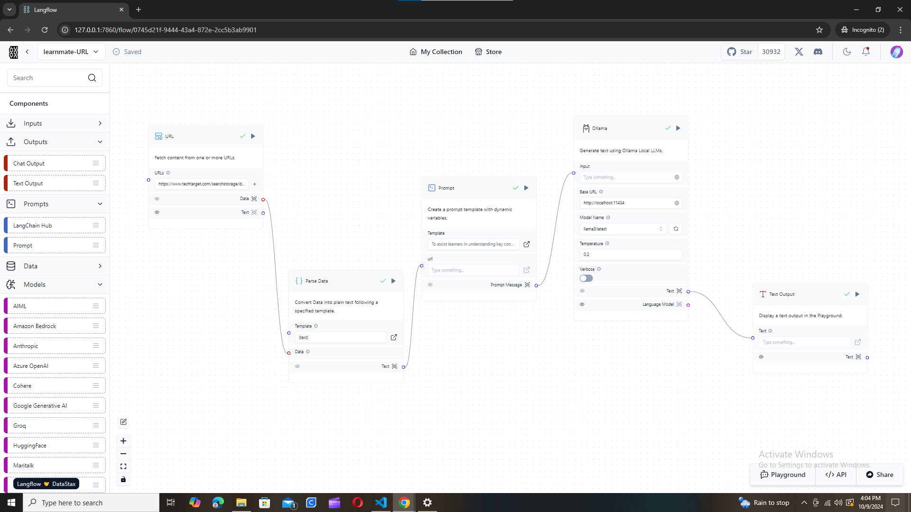

### This is my Undergraduate Final Year Project (FYP) on "Web-based Extension that uses LLMs to provide content summarization and quiz generation".

## The project is divided into two main parts:
#### 1. Content Summarization
#### 2. Quiz Generation
##### but also:
#### 3. Personalization - focus on users with learning disabilities 

>[!IMPORTANT]
>The project is still under development. Both the Model and extension are not fully developed.

## How to use the Model
>[!NOTE]
>This project uses Llama3 LLM for summarization and quiz generation. 

## Running Ollama and Langflow with Python Virtualenv

This guide will help you get Ollama and LangFlow up and running using a Python virtual environment.

## Prerequisites

- Python3
- Virtualenv


## Create a virtual environment

1. Download Ollama and Llam3 Model

    1. Visit [ollama.com](https://ollama.com/)
    2. Download and install Ollama
    3. Open a terminal window and download the llama3 model

    ```sh
    ollama run llama3
    ```

    Ensure that Llama3 is working before you proceed.

2. Clone the Hackathon repository:

```sh
git clone https://github.com/karanidenis/Capstone
```

3. Navigate to the `Backend` directory:

```sh
cd Backend
```

3. Create a new virtualenv:

```sh
python3 -m venv venv
```

3. Activate the virtualenv:

```sh
source env/bin/activate
```

4. Install requirements

    ```sh
    pip install -r requirements.txt
    ```

5. Run langflow

    ```sh
    python -m langflow run
    ```

6. The flows are as below:




LangFlow will now be accessible at [http://localhost:7860/](http://localhost:7860/).
Llama 3 via Ollama will now be available at [http://localhost:11434/](http://localhost:11434/).

## Run the apps

### Ollama - Langflow

The examples enable you to:
1. Ask Llama3 for summary of text content you provide
2. Ask Llama3 for a summary of the content of webpage of the url you provide

You must be in the `Backend` directory for the following:

1. Ask Llama3 for summary of text content you provide

```sh
python3 learnmate-model.py
```

expect result:


2. Ask Llama3 for a summary of the content of webpage of the url you provide

```sh
python learnmate-url-model.py
```


expected output:


This project uses Llama3 model connected by Ollama. The model takes content from user and provides summary or questions depending on user request. 

## How to use the Extension

>[!TIP]  
> 1. Clone your repository if it's not on your computer already.  
> 2. On Edge, go to `edge://extensions`, or on Chrome, go to `chrome://extensions`.  
> 3. Toggle on "Developer Mode".  
> 4. Click the "Load Unpacked" button.  
> 5. Select the `personal_extension`.  
> 6. Reload your browser and make sure the extension is toggled on.  
> 7. And you're installed!

>[!NOTE]
>The extension has a few bugs but will be available for testing soon!

Watch the video of the project Here

<a href="https://youtu.be/ITblLkJha4A" target="_blank">Learmate project</a>
